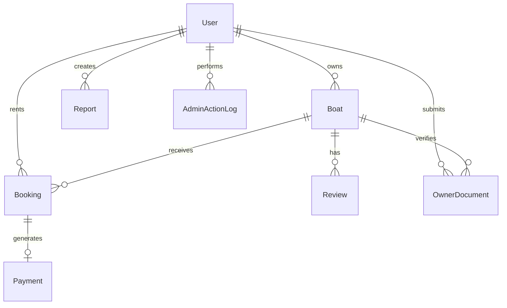
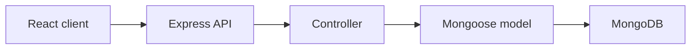
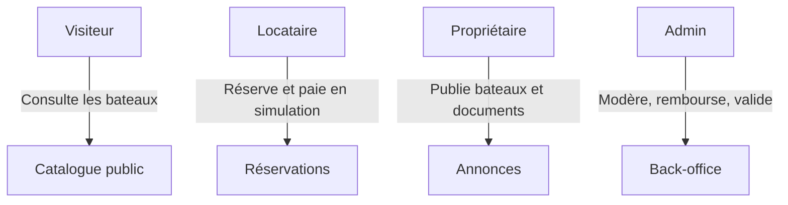
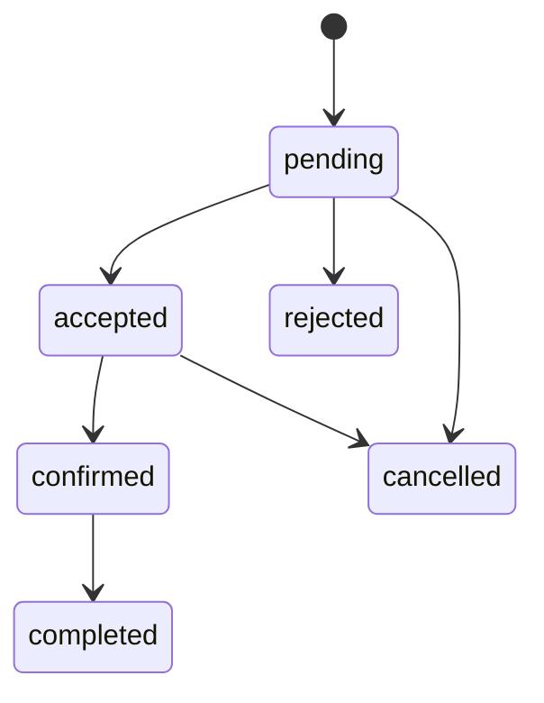
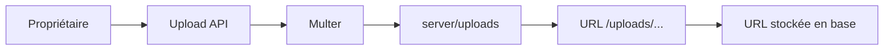

# Architecture SailingLoc

## Vue d ensemble

SailingLoc est une plateforme MVP de location de bateaux entre particuliers. Elle couvre les rôles visiteur, locataire, propriétaire et administrateur.

## Stack

- Frontend: React, Vite, Tailwind, Axios, React Router.
- Backend: Node.js, Express, JWT, Mongoose.
- Base de données: MongoDB.
- Tests: Node test runner, Supertest, Playwright.
- Documentation API: Swagger/OpenAPI.

## Structure

- `client/src`: application React.
- `server/src/controllers`: logique métier API.
- `server/src/routes`: routes Express.
- `server/src/models`: modèles Mongoose.
- `server/tests`: tests API.
- `docs`: documentation architecture, production, backup, monitoring.

## Schéma BDD

## Flux API

## Rôles

## Workflow réservation

## Workflow upload

## Paiement

Le paiement est simulé via un modèle `Payment` et un provider `simulated-stripe`. Les statuts sont cohérents avec les réservations, mais aucun PSP réel n est connecté.

## Modération admin

L admin peut valider/rejeter bateaux, avis et documents, gérer les utilisateurs, consulter les paiements et suivre les actions dans `AdminActionLog`.

## Sécurité

JWT, rôles serveur, rate limiting, Helmet, validation express-validator, filtrage upload par type MIME et taille.

## Limites MVP

Paiement simulé, email non configuré, upload local, vérification documentaire manuelle, pas de messagerie temps réel, pas d audit sécurité complet.

## Améliorations futures

Stripe réel, stockage cloud, SMTP/reset password réel, messagerie, assurance partenaire, CI de déploiement, monitoring complet.
